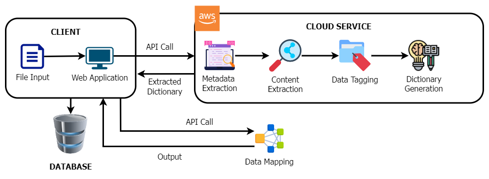
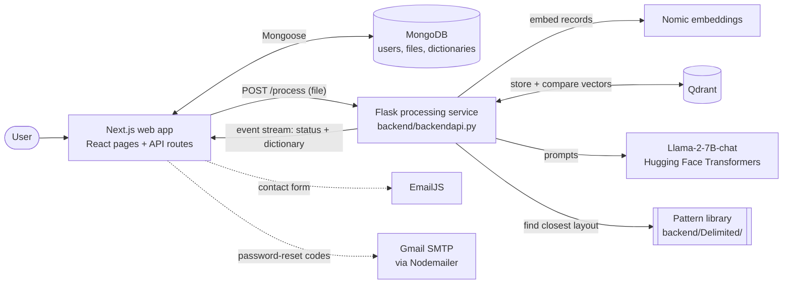

# IntelliDatum

**IntelliDatum** is an AI-assisted web application that turns unstructured, delimiter-separated data files into structured **data dictionaries**. Upload a raw `.txt` or `.csv` file and IntelliDatum detects its structure, groups the record types it contains, names every column with a large language model, and generates an EPF/XML data dictionary that you can review, edit and download.

> Final Year Project **F24-167-D**, Department of Computer Science, FAST-NUCES Islamabad (Session 2021–2025), built in collaboration with **Data Insight Lab**.

## Contents

- [The problem](#the-problem)
- [The solution](#the-solution)
- [Features](#features)
- [How it works](#how-it-works)
- [Tech stack](#tech-stack)
- [Project structure](#project-structure)
- [Getting started](#getting-started)
- [How to use](#how-to-use)
- [Configuration](#configuration)
- [API reference](#api-reference)
- [Notes and limitations](#notes-and-limitations)
- [Data and privacy](#data-and-privacy)
- [Team](#team)

## The problem

Companies that process data on behalf of their clients receive large volumes of it every day as unstructured files: delimiter-separated, fixed-length, line-data and XML. These files often have missing headers or inconsistent layouts. Today a data designer interprets each file by hand, working out which record types are present, where each field starts and ends, and what every column means, before mapping it to a dictionary (schema). The process is slow, repetitive and error-prone.

## The solution

IntelliDatum automates that work with machine learning and generative AI. A processing service detects the file's structure, uses vector embeddings to group records of the same type, and asks a large language model to infer a name for each column. Few-shot examples taken from the most similar known file layout guide the model. The result is a ready-to-use data dictionary.

The web app wraps this in a simple workflow: sign in, upload a file, review the generated dictionary, correct anything the model got wrong, and download it.

This repository contains the web application and the processing service for **delimiter-separated** files.

## Features

- **Smart file detection**: detects the delimiter (comma, pipe, semicolon or tab) and `***`-style document separators in multi-document files.
- **Record grouping**: groups lines that belong to the same record type using vector embeddings, which separates the record types in multi-record files.
- **AI column naming**: Llama-2 infers a meaningful name for every column from sample values, guided by the closest known file pattern.
- **Dictionary generation**: produces an EPF/XML data dictionary with document, record and field definitions.
- **Dictionary editor**: rename fields while the matching column is highlighted in the original file.
- **Dashboard**: shows total, successful and failed files, and lets you view, edit, download or delete each result.
- **User accounts**: sign up and sign in with JWT authentication, profile picture and change password. Forgot-password emails a one-time 6-digit code that is generated and hashed on the server, expires after 15 minutes and locks after 5 wrong attempts.
- **Contact form** powered by EmailJS.

## How it works

### Architecture



### Components



1. On the **Upload File** page the browser sends the file to the processing service (`POST /process`) and shows streamed status updates.
2. The service runs the pipeline below and streams the generated dictionary back.
3. Through its own API routes, the web app stores the original file, the processing status and the dictionary in MongoDB, where the dashboard and the editor read them.

### Processing pipeline

All of this lives in [`backend/backendapi.py`](backend/backendapi.py).

| # | Step | What happens | Code |
|---|------|--------------|------|
| 1 | Structure detection | The most frequent delimiter in the first line is chosen; lines made only of `*` are treated as document separators. | `detect_delimiter`, `check_doc_separator` |
| 2 | Record embedding | Every record (line) is embedded with Nomic `nomic-embed-text-v1` (768 dimensions) and stored in the Qdrant collection `All_Records_nomic`. | `get_embeddings`, `upload_in_batches` |
| 3 | Record grouping | Records are grouped when their cosine similarity is above 0.6 and they have the same number of fields, or when they share the same first field (the record ID). | `group_records`, `is_similar` |
| 4 | Column sampling | Each group is split into columns, and the three most complete of its first five rows become the sample values for `Column_1 … Column_N`. | `column_seperation`, `clean_Columns` |
| 5 | Dataset description | Llama-2-7B-chat writes a short (100 words or fewer) description of what the data is about. | `project_level_desc` |
| 6 | Pattern matching | The description is compared with each known layout's `description.txt` using TF-IDF and cosine similarity. | scikit-learn `TfidfVectorizer` |
| 7 | Column naming | Llama-2 receives the matched layout's `pattern.json` as few-shot examples and predicts a name for each column. | LangChain prompt + `HuggingFacePipeline` |
| 8 | Dictionary | An EPF/XML dictionary is built from the predicted names, the delimiter and the document separator. | `DictionaryGenerate` |

The response is a server-sent event stream: `data: Processing` while the pipeline runs, then `data: Final result: <base64-encoded dictionary>`.

### Example output

A dictionary for an orders export: a comma-separated file with quoted fields and a header row. `<doc-info>` describes how the file splits into records and fields, and `<data-layout>` lists each field's position, name and type.

```xml
<data-map name="Orders" type="Delimited" encoding="iso-8859-1" version="1.0.1">
  <doc-info separator="CharSequence" value="\r\n">
    <record-info multi-record="False" rec-id-length="0" rec-length="0" separator="\r\n" skip-first-record="True"/>
    <field-info end-delimiter="&quot;" separator="," start-delimiter="&quot;"/>
  </doc-info>
  <data-layout>
    <record name="OrderInfo" type="Repeat">
      <field index="1" name="OrderID" type="String"/>
      <field index="2" name="CustomerID" type="String"/>
      <field index="3" name="EmployeeID" type="String"/>
      <field index="4" name="OrderDate" type="String"/>
      <field index="5" name="RequiredDate" type="String"/>
      <field index="6" name="ShippedDate" type="String"/>
      <field index="7" name="ShipVia" type="String"/>
      <field index="8" name="Freight" type="String"/>
      <field index="9" name="ShipName" type="String"/>
      <field index="10" name="ShipAddress" type="String"/>
      <field index="11" name="ShipCity" type="String"/>
      <field index="12" name="ShipRegion" type="String"/>
      <field index="13" name="ShipPostalCode" type="String"/>
      <field index="14" name="ShipCountry" type="String"/>
    </record>
  </data-layout>
</data-map>
```

## Tech stack

| Layer | Technologies |
|-------|--------------|
| Frontend | Next.js 15 (App Router), React 19, Bootstrap 5, Tailwind CSS, Heroicons, Lucide, React Icons, SweetAlert2, react-hot-toast |
| Web API | Next.js API routes (Node.js), MongoDB with Mongoose 8, JSON Web Tokens, bcrypt |
| Processing service | Python, Flask 3, Flask-CORS |
| AI / ML | Llama-2-7B-chat via Hugging Face Transformers and PyTorch, LangChain, Nomic embeddings, Qdrant vector database, scikit-learn, NumPy |
| Email | Nodemailer with Gmail (password-reset codes), EmailJS (contact form) |

## Project structure

```text
intellidatum/
├── app/                      # Next.js App Router
│   ├── api/
│   │   ├── auth/             # register, login, password reset/change, profile update
│   │   ├── files/            # save, list, read, update and delete files and dictionaries
│   │   └── user/             # profile picture
│   ├── context/auth.js       # auth state (JWT + user) persisted in localStorage
│   ├── lib/                  # MongoDB connection, JWT verification
│   ├── dashboard/            # stats + file list: view / edit / download / delete
│   ├── files/                # upload and process a file
│   ├── view-dictionary/      # read-only dictionary view
│   ├── edit-dictionary/      # dictionary editor with column highlighting
│   ├── signin/  signup/  forgotPassword/  reset-password/
│   ├── profile/  edit-profile/  change-password/  contactus/
│   └── page.jsx              # landing page
├── backend/
│   ├── backendapi.py         # Flask processing service (POST /process)
│   ├── requirements.txt
│   └── .env.example
├── components/               # Header, Footer
├── controllers/              # auth, file and user logic used by the API routes
├── docs/                     # images used in this README
├── models/                   # Mongoose schemas: User, File, reset_token
├── helpers/                  # password hashing, email template
├── Middlewares/              # JWT and admin checks
├── public/                   # images, icons and logos
├── .env.example
└── next.config.ts
```

## Getting started

### Prerequisites

- **Node.js 18.18+** and npm
- **MongoDB**, either a local server or a free [MongoDB Atlas](https://www.mongodb.com/atlas) cluster
- **Python 3.10+**
- **Qdrant**, either a [Qdrant Cloud](https://cloud.qdrant.io) cluster or a local instance (`docker run -p 6333:6333 qdrant/qdrant`)
- A **Nomic API key** from [atlas.nomic.ai](https://atlas.nomic.ai)
- A **Hugging Face access token**, with access granted to [`meta-llama/Llama-2-7b-chat-hf`](https://huggingface.co/meta-llama/Llama-2-7b-chat-hf) (request access on the model page)
- A **Gmail account with an [App Password](https://support.google.com/accounts/answer/185833)**, used to email password-reset codes
- An **EmailJS** account, optional, for the contact form

> **Hardware:** the backend loads Llama-2-7B on the CPU in full precision. Plan for roughly **28 GB of free RAM** and about **13 GB of disk** for the model download. Processing a file can take several minutes.

### 1. Clone the repository

```bash
git clone https://github.com/ZinoorFatima/intellidatum.git
cd intellidatum
```

### 2. Start the processing service

```bash
cd backend
python -m venv .venv
# Windows:      .venv\Scripts\activate
# macOS/Linux:  source .venv/bin/activate
pip install -r requirements.txt
cp .env.example .env          # then fill in your Qdrant, Nomic and Hugging Face keys
```

Add the [pattern library](#pattern-library) at `backend/Delimited/`, then start the service **from inside `backend/`**:

```bash
python backendapi.py          # serves http://localhost:5000
```

By default the service only listens on `127.0.0.1` and Flask's debugger is off; see `FLASK_HOST`, `FLASK_PORT` and `FLASK_DEBUG` under [Configuration](#processing-service-backendenv). The model is downloaded from Hugging Face the first time a file is processed.

### 3. Start the web app

In a second terminal, from the repository root:

```bash
npm install
cp .env.example .env          # then fill in MongoDB, JWT secret, backend URL, Gmail sender and EmailJS ids
npm run dev
```

Open [http://localhost:3000](http://localhost:3000). Keep the web app on port 3000, because the backend's CORS settings only allow `http://localhost:3000`.

For a production build, run `npm run build` followed by `npm start`. `next.config.ts` uses `output: "standalone"`, which was set up for AWS Amplify.

### Pattern library

Step 6 of the pipeline needs a library of known file layouts. Each layout is a folder containing a description and few-shot examples:

```text
backend/Delimited/
├── <layout-name>/
│   ├── description.txt   # a short description of what this kind of file contains
│   └── pattern.json      # example values and the column names they map to
└── <another-layout>/
    └── ...
```

`description.txt` is matched against the description the model writes for an uploaded file. The matching `pattern.json` is inserted into the column-naming prompt as examples, so any readable JSON works. For example:

```json
[
  {
    "values": ["HDR", "PL-2018", "Example Clinic", "01/09/2018"],
    "columns": ["Record Type", "Plan Code", "Provider Name", "Effective Date"]
  }
]
```

The library used during the project was built from confidential client data, so it is **not** included in this repository. You need to build your own from files you are allowed to use.

## How to use

1. **Create an account.** Choose **Sign Up** and enter your first and last name, email, an 11-digit phone number and a strong password (8+ characters with upper- and lower-case letters, a digit and a special character).
2. **Sign in.** The header then shows a menu with **Profile**, **Dashboard** and **Logout**.
3. **Upload a file.** Open **Files** (or **Upload File** on the dashboard), drag and drop a `.txt` or `.csv` file or click to choose one, then press **Process**. The status updates while the backend works, and the generated dictionary appears in the **Preview** box.
4. **Review results on the dashboard.** You see totals for all, successful and failed files. For each file you can **view**, **edit**, **download** (`.xml`) or **delete** the dictionary. Failed files cannot be opened.
5. **Edit a dictionary.** In the editor, click into a field to highlight the matching column in the original file content, rename it, then **Save**.
6. **Manage your account.** From **Profile** you can edit your name and profile picture, or change your password. If you forget your password, use **Forgot Password**: a 6-digit code is emailed to you, and you enter it on the **Reset Password** page. The code works once, expires after 15 minutes and locks after 5 wrong attempts; after a lock, wait 15 minutes and request a new code.
7. **Contact Us** sends a message to the team through EmailJS.

## Configuration

All secrets live in `.env` files that git ignores. Copy each `.env.example` and fill in your own values.

### Web app (`.env` in the repository root)

| Variable | Required | Description |
|----------|----------|-------------|
| `MONGODB_URI` | Yes | MongoDB connection string. Also needed at build time. |
| `JWT_SECRET` | Yes | Secret used to sign login tokens. |
| `BACKEND_API` | Yes | Base URL of the processing service, without a trailing slash, e.g. `http://localhost:5000`. |
| `EMAIL_ID` | For password reset | Gmail address that sends the reset codes. |
| `EMAIL_PASSWORD` | For password reset | A Google App Password for that account (not the normal password). |
| `NEXT_PUBLIC_EMAILJS_SERVICE_ID` | For the contact form | EmailJS service ID. |
| `NEXT_PUBLIC_EMAILJS_PUBLIC_KEY` | For the contact form | EmailJS public key. |
| `NEXT_PUBLIC_EMAILJS_CONTACT_TEMPLATE_ID` | For the contact form | Template that receives `name`, `email` and `message`. |

Next.js reads these at startup and inlines some of them at build time, so restart `npm run dev` or rebuild after changing them.

### Processing service (`backend/.env`)

| Variable | Required | Description |
|----------|----------|-------------|
| `QDRANT_URL` | Yes | Qdrant endpoint: a Qdrant Cloud cluster URL or `http://localhost:6333`. |
| `QDRANT_API_KEY` | Qdrant Cloud only | API key for the cluster. |
| `NOMIC_API_KEY` | Yes | Nomic key for `nomic-embed-text-v1` embeddings. |
| `HF_TOKEN` | Yes | Hugging Face token with access to `meta-llama/Llama-2-7b-chat-hf`. |
| `FLASK_HOST` | No | Address to listen on. Defaults to `127.0.0.1` (this machine only). |
| `FLASK_PORT` | No | Port to listen on. Defaults to `5000`; keep `BACKEND_API` in sync. |
| `FLASK_DEBUG` | No | `true` turns on Flask's debugger. Defaults to `false`; never enable it on a reachable machine, because the debugger can run code. |

## API reference

### Processing service

| Method | Endpoint | Description |
|--------|----------|-------------|
| `POST` | `/process` | Multipart form with a `file` field (`.txt` or `.csv`, up to 16 MB). Returns a `text/event-stream` of status lines followed by `Final result: <base64 dictionary>`. |

### Web app API routes

Routes marked **JWT** need an `Authorization: Bearer <token>` header, using the token from `/api/auth/login`. They only act on the signed-in user: the user ID comes from the token, and a file that belongs to someone else returns 404.

| Method | Endpoint | Auth | Description |
|--------|----------|------|-------------|
| `POST` | `/api/auth/register` | – | Create an account. |
| `POST` | `/api/auth/login` | – | Sign in; returns a JWT (valid for 7 days) and the user profile. |
| `POST` | `/api/auth/create-reset-token` | – | Email a one-time 6-digit reset code (`{ email }`). The response is the same whether or not the account exists. |
| `POST` | `/api/auth/reset-password` | – | Reset a password with `{ email, token, password }`, where `token` is the emailed code. |
| `POST` | `/api/auth/change-password` | JWT | Change your password given the current one. |
| `POST` | `/api/auth/update-profile` | JWT | Update your name and profile picture (multipart). |
| `GET` | `/api/user/profile-picture` | JWT | Get your profile picture. |
| `POST` | `/api/files/write-file` | JWT | Save an uploaded file with its status and generated dictionary (multipart, up to 10 MB). |
| `GET` | `/api/files/read-file` | JWT | List your files and dictionaries. |
| `GET` | `/api/files/read-file-by-id?fileId=` | JWT | Get one of your files and its content. |
| `GET` | `/api/files/get-dictionary?fileId=` | JWT | Get a file's dictionary. |
| `PUT` | `/api/files/update-dictionary` | JWT | Save an edited dictionary (`{ fileId, content }`). |
| `DELETE` | `/api/files/delete-file?fileId=` | JWT | Delete a file and its dictionary. |

## Notes and limitations

- **Scope:** the project proposal also targets fixed-length, line-data and XML files. The web app in this repository supports delimiter-separated `.txt` and `.csv` files.
- **One layout per dictionary:** the generated dictionary describes a single record layout, the last record group found in the file.
- **Performance:** Llama-2 is loaded on the CPU, in full precision, for every request, so processing is slow and memory-hungry. A GPU or a quantized model would speed it up considerably.
- **One file at a time:** the Qdrant collection is cleared at the start of every request, so the service should process one file at a time.
- **Academic prototype:** the app is not production-hardened. The processing service has no authentication of its own (keep it on `127.0.0.1` or behind the web app), there is no rate limiting on sign-in or reset requests, and the JWT is kept in `localStorage`. Update dependencies, including Next.js, to their latest patched versions before any public deployment.

## Data and privacy

This repository intentionally contains **no data files and no credentials**:

- Sample files, uploaded files and the pattern library came from an industry partner's clients and are confidential.
- `uploads/`, `Delimited/` and data formats such as `.csv`, `.epf` and `.xlsx` are git-ignored.
- All keys and connection strings are read from `.env` files, which are also git-ignored.

## Team

| Name | GitHub |
|------|--------|
| Ume Khadija | [@Ukhadija](https://github.com/Ukhadija) |
| Zinoor Fatima | [@ZinoorFatima](https://github.com/ZinoorFatima) |
| Haniya Usman | [@Haniya075](https://github.com/Haniya075) |

**Supervisor:** Dr. Asif Naeem  
**Co-supervisor:** Mr. Muhammad Aamir Gulzar

Department of Computer Science, National University of Computer and Emerging Sciences (FAST-NUCES), Islamabad, with thanks to **Data Insight Lab** and our industry partner for the problem statement, guidance and data.
